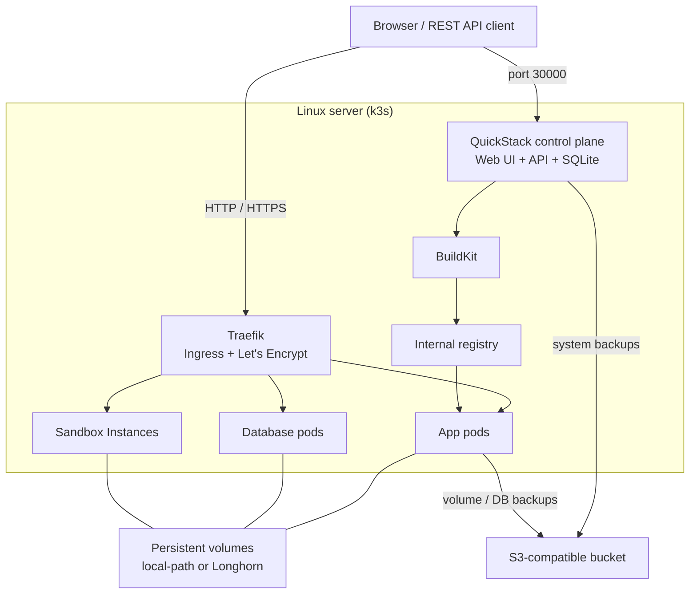
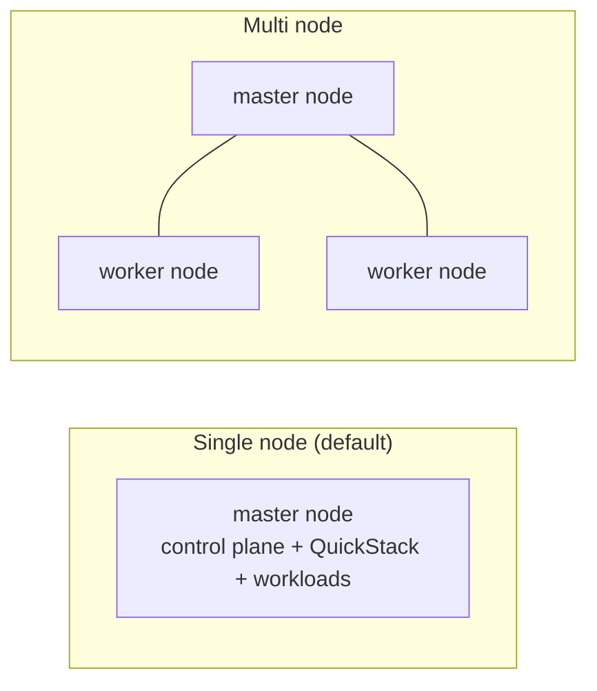
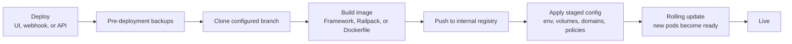

QuickStack is a control plane that turns a Linux server into a self-hosted platform. It runs on [k3s](https://k3s.io/), a lightweight Kubernetes distribution, and exposes a web UI on top of Kubernetes primitives. You never have to write manifests or run `kubectl` for day-to-day work.

This page explains what runs where and what happens when you click **Deploy**. For the task-oriented steps, see the [tutorials](/docs/tutorials/installation) and [how-to guides](/docs/how-to/project-canvas).

## Components

| Component | Role |
|-----------|------|
| **QuickStack control plane** | A Kubernetes pod that serves the web UI and API and stores all configuration in a SQLite database (`storage/db/data.db`). |
| **k3s** | The Kubernetes distribution that schedules apps, databases, and build jobs. |
| **Traefik** | The reverse proxy and ingress controller. Terminates HTTP/HTTPS and provisions Let's Encrypt certificates. |
| **Longhorn** | Distributed block storage for volumes in multi-node clusters. Single-node installs use `local-path` by default. |
| **BuildKit** | Builds Docker images from Git sources. |
| **Internal registry** | Stores images built from Git so deployments can pull them by immutable commit tag. |

Technologies not bundled by QuickStack can be added as [cluster add-ons](/docs/how-to/admin/cluster-add-ons) (Longhorn, cert-manager, and, on the canary channel, the Kubernetes Agent Sandbox and gVisor).

### How the pieces fit together

## Cluster topology

- **Single node** (default): one server runs the k3s control plane, QuickStack, and all workloads. Volumes use the `local-path` storage class.
- **Multi node**: the first server is the **master node**; additional servers join as **worker nodes**. QuickStack schedules workloads across nodes and Longhorn replicates volumes. See [Cluster Nodes](/docs/how-to/admin/cluster-nodes).

## What happens when you deploy

1. **Build** (Git sources only) — QuickStack clones the configured branch, builds an image with BuildKit using the selected [build method](/docs/how-to/deployments/build-methods), and pushes it to the internal registry. Each build is tagged with the short commit hash and a moving `latest` tag.
2. **Backup** — any volume backup schedule marked **Backup before deployment** runs first. See [Volume Backups](/docs/how-to/backups/volume-backups#back-up-before-deployment).
3. **Apply configuration** — staged settings (environment variables, volumes, domains, network policies, health checks, resource limits) are written to the workload.
4. **Roll out** — QuickStack creates or updates a Kubernetes Deployment and performs a rolling update: new pods start, and old pods terminate once the new ones are ready.

<Callout>
**Image sources skip the build steps**
Apps that use a Docker image or a template pull the image directly instead of cloning and building. The backup, apply-config, and rollout steps are identical.
</Callout>

<Callout>
**Configuration is staged until you deploy**
Editing settings only changes the stored configuration. Clicking **Deploy** is what applies it to the running workload. See [Deploy & Redeploy](/docs/how-to/deployments/redeploy-and-rollbacks).
</Callout>

## Networking at a glance

- **External HTTP(S) traffic** enters through Traefik on ports `80`/`443` and is routed to an app by its [domain](/docs/how-to/networking/domains).
- **Internal traffic** between workloads uses Kubernetes service hostnames of the form `svc-<app-id>.<project-id>.svc.cluster.local` and is deny-by-default. See [Networking & Policies](/docs/how-to/networking).
- **Non-HTTP traffic** can be exposed directly on cluster nodes with [Node Ports](/docs/how-to/networking/node-ports).
- The QuickStack UI itself is served on port `30000` until you assign it a domain.

See [Ports & Endpoints](/docs/reference/ports-and-endpoints) for the full list.

## Where data lives

| Data | Location |
|------|----------|
| QuickStack configuration (projects, users, apps, secrets) | SQLite database inside the QuickStack pod |
| Application volumes | Kubernetes PersistentVolumes (`local-path` or `longhorn`) |
| Built images | Internal registry |
| Backups | S3-compatible object storage configured as an [S3 target](/docs/how-to/backups/s3-targets) |

The configuration database is backed up separately from application data as a [system backup](/docs/how-to/backups/system-backups).

## Related

- [Projects, Apps & Databases](/docs/concepts/projects-apps-databases)
- [Security Model](/docs/concepts/security-model)
- [Installation](/docs/tutorials/installation)
